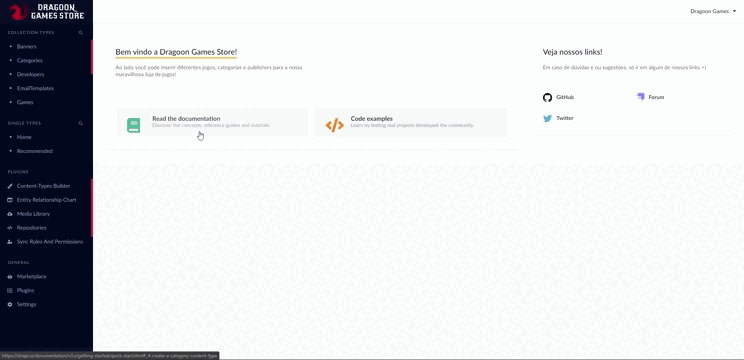
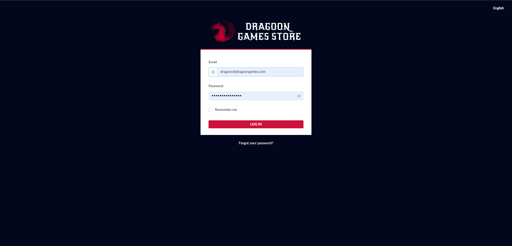
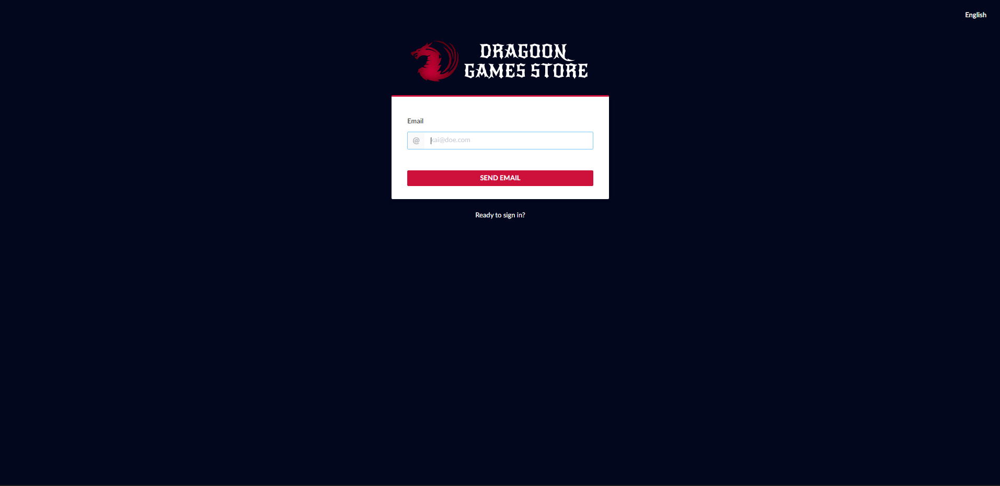

<p align="center">
  
</p>

<h1 align="center">
Dragoon Games Store API 
</h1>

<p align="center">

  

  

  <a href="https://www.linkedin.com/in/alquiponeto/">
      
  </a>

  <a href="https://github.com/Alquipo/dragoongames-api/commits/master">
      
  </a>

  


</p>

<p align="center">

  <a target="_blank" href="https://strapi.io/">
    
  </a>

   <a target="_blank" href="https://stripe.com/br">
    
  </a>

   <a target="_blank" href="https://www.postgresql.org/">
    
  </a>
 
</p>

## 🚀 Sobre o Projeto

Dragoon Games Store é um e-commerce completo para comprar jogos, nesse repositório estão os arquivos do Back-end da Loja, Aplicação foi desenvolvida usando Strapi CMS, Stripe como API de pagamentos, Postgres como banco de dados e o Crawler para extrair dados dos jogos foi feito do site da [GOG.com](https://www.gog.com/).

Aplicação está completa com autenticação, compras de jogos, cadastro de jogos, wishlist e cadastro de usuário

## 🚀 Como rodar este projeto

Para clonar e executar este aplicativo, você precisará de [Git](https://git-scm.com), [NodeJs](https://nodejs.org/en/) e [Postgres](https://www.postgresql.org/) Instalado em seu computador.

Esse projeto usa PostgresSQL como banco de dados, instale em seu computador ou use uma imagem do [Docker](https://www.docker.com/) para rodar o projeto.

Para configurar o Banco de dados vá para a pasta `config/database.js` e edite o arquivo.

## 🎨 Layout

### Dashboard

<h4 align="center">
  
</h4>

#### Login

<h4 align="center">
  
  
  
  
</h4>

<br/>

## 🔨 Tecnologias:

- **[StrapiCMS](https://strapi.io/)**
- **[Stripe](https://stripe.com/br)**
- **[Postgres](https://www.postgresql.org/)**
- **[JSDom](https://github.com/jsdom/jsdom)**

## 🔎 Comandos

- `develop`: Executa a aplicação em `localhost:1337/admin`
- `develop --watch-admin`: Executa a aplicação em para editar interface em tempo real `localhost:8000/admin`
- `build`: Cria a Build do projeto

## 🚀 Como rodar este projeto

### 🌀 Clonando o repositório

```bash
# Clone este repositório
$ git clone https://github.com/Alquipo/dragoongames-api

# Acesse a pasta do projeto no terminal/cmd
$ cd dragoongames-api
```

### 🎲 Rodando a Aplicação

```bash
# Instale as dependências
$ yarn install

# Execute a Aplicação em Desenvolvimento
$ yarn develop

# O servidor iniciará na porta:1337 - acesse http://localhost:1337/admin
# GraphQL playground para testar as queries: http://localhost:1337/graphql

# Verifique o arquivo em config > database.js (caso tenha necessidade pode alterar os dados do banco de dados)
```

### 🎲 Configurar email template e permissões automaticamente (opcional)

```bash
# Importar as permissões

Vá ate o painel de administração > Plugins > Sync Roles and Permissions

Importe o arquivo JSON que está na raiz do projeto (strapi-roles-and-permissions.json)

# Importa email Template

Vá ate o painel de administração > Plugins > Email Designer

Importe o arquivo JSON que está na raiz do projeto (email-designer-templates.json)
```

### 🏦 Usando Bando de dados pronto no DOCKER (opcional 1)

```bash
# Montando imagem pronta do Banco de dados

$ docker run --name DragoonGames -p 5432:5432 -d alquipo/dragoongames-database:latest

# Acesse o localhost:1337/admin com o usuário abaixo:

email: dragoon@dragoongames.com
password: DragoonGames123
```

### 🏦 Usando banco de dados manualmente (opcional 2)

```bash
# Clonar o repositório com o banco de dados

$ git clone https://github.com/Alquipo/dragoongames-database

$ cd dragoongames-database

# Opção 1: montando imagem com Dump

$ docker build -t dragoon_database .

$ docker run --name DragoonGames -p 5432:5432 -d dragoon_database

# Opção 2 restaurar o dump em um novo banco de dados

$ cat dump.sql | docker exec -i NOME_DO_SEU_CONTAINER psql -U SEU_USUARIO -d SUA_DATABASE

# Acesse o localhost:1337/admin com o usuário abaixo:

email: dragoon@dragoongames.com
password: DragoonGames123

```

### 🏦 Usando o Dump manualmente (opcional 3)

```bash
# Primeiro faça download do dump no repositório do banco de dados

https://github.com/Alquipo/dragoongames-database

# Criar database e usuário no Postgres:

$ CREATE USER dragoongames WITH ENCRYPTED PASSWORD 'dragoongames123';
$ CREATE DATABASE dragoongames OWNER dragoongames;

# Popule o banco de dados usando o comando abaixo (lembre que tem que ser executado onde voce guardou o arquivo dump.sql)

$ psql -h localhost -p 5432 -U dragoongames dragoongames < dump.sql

# Acesse o localhost:1337/admin com o usuário abaixo:

email: dragoon@dragoongames.com
password: DragoonGames123
```

### 🔎 Comandos para popular o Banco de dados

```bash
Vá em settings > roles & Permission > public e marque a a opção game:populate e upload:upload para liberar a rota de upload

# Irá buscar os jogos na GOG na primeira pagina
$ curl -X POST http://localhost:1337/games/populate

# Outros comandos para popular a API
$ curl -X POST http://localhost:1337/games/populate?page=2
$ curl -X POST http://localhost:1337/games/populate?search=simcity
$ curl -X POST http://localhost:1337/games/populate?sort=rating&price=free
$ curl -X POST http://localhost:1337/games/populate?availability=coming&sort=popularity
```

### 💾 Comandos Úteis

```bash
#Restaurar o Dump para o Docker
$ cat dump.sql | docker exec -i NOME_CONTAINER psql -U NOME_USUÁRIO -d dragoongames

#Efetuar o Dump do docker
$ docker exec -i SEU_CONTAINER pg_dump --username USERNAME --password NAME_DATABASE > dump.sql
```

### 📁 Configuração .ENV

```bash
#adicionado .env.example no projeto, lembrar de adicionar as variáveis de ambiente conforme o exemplo

# adicionar o token do Stripe
STRIPE_PRIVATE_KEY
```

## 🤔 Como contribuir para o projeto

- Faça um **fork** do projeto;
- Crie uma nova branch com as suas alterações: `git checkout -b my-feature`
- Salve as alterações e crie uma mensagem de commit contando o que você fez:`git commit -m "feature: My new feature"`
- Envie as suas alterações: `git push origin my-feature`

> Caso tenha alguma dúvida confira este [guia de como contribuir no GitHub](https://github.com/firstcontributions/first-contributions)

## 📝 Licença

Este projeto esta sobe a licença MIT. Veja a [LICENÇA](https://opensource.org/licenses/MIT) para saber mais.

Feito com ❤️ por Alquipo Neto 👋🏽 [Entre em contato!](https://www.linkedin.com/in/alquiponeto/)
